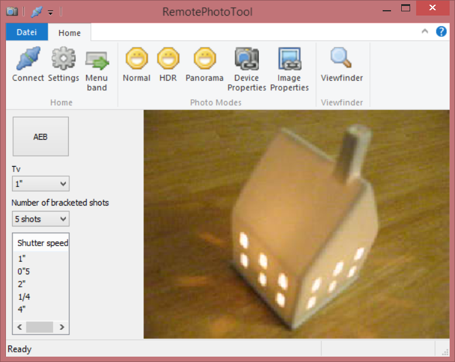

# RemotePhotoTool #

## About ##

RemotePhotoTool is a remote image capture application for Canon based cameras. It supports taking HDR and Panorama photos.

Supported cameras are:

EOS cameras: EOS 40D, EOS 60D, EOS 600D, EOS 1100D, EOS 5D MarkIII, EOS 1D X, EOS 650D, EOS 6D / EOS-1D C

PowerShot cameras: G10, G9, G7, S5 IS, S3 IS, S80, SX110 IS, SX100 IS, A640 and A620

See below at chapter "Compatibility" for a complete list of supported cameras.

## Download ##

Download and install this package to get RemotePhotoTool:

- [RemotePhotoTool-1.0.0-Setup.msi](https://github.com/vividos/RemotePhotoTool/releases/download/remotephototool-1.0.0/RemotePhotoTool-1.0.0-Setup.msi): RemotePhotoTool 1.0.0 Build 100, Windows Installer (5808 kb)

On Windows 7 and above you usually don't need additional drivers for Canon cameras.

## Features ##

* Remote capture and transfer to PC
* Live Viewfinder
* Photo Modes: Normal, HDR, Panorama (planned: HDR Panorama, Timelapse video, Photo stacking)
* Tool support for PhotoMatix 4, Hugin

See the full Features document here: [Features.md](Features.md)

## Screenshots ##

This is the HDR Photo mode with active Viewfinder:
 

See more screenshots here: [Screenshots.md](Screenshots.md)

## Compatibility ##

Note that most cameras may work, but due to the fact that I only own an EOS 40D and a Powershot
G9, not all cameras are tested. All tested cameras are marked  `tested and works`. If you want
to report a working camera, test the application with the Test Cases (see below for a link)
and send me a message with the camera infos.

### Canon EOS camera models ###
- EOS 1000D  (aka. Rebel XS, Kiss F)
- EOS 1100D (aka. Rebel T3, Kiss X50)
- EOS 450D (aka. Rebel Xsi, Kiss X2)
- EOS 500D (aka. Rebel T1i, Kiss X3)
- EOS 550D (aka. Rebel T2i, Kiss X4)
- EOS 600D (aka. Rebel T3i, Kiss X5)
- EOS 650D (aka. Rebel T4i, Kiss X6i)
- EOS 40D (`tested and works`)
- EOS 50D
- EOS 60D 
- EOS 60Da 
- EOS 5D Mark II
- EOS 5D Mark III
- EOS 6D
- EOS 7D
- EOS-1D C
- EOS-1D Mark III
- EOS-1Ds Mark III
- EOS-1D Mark IV
- EOS 1D X

### Canon Powershot camera models ###
- Powershot G10
- Powershot G9 (`tested and works`)
- Powershot G7
- Powershot S5 IS
- Powershot S3 IS
- Powershot S80
- Powershot SX110 IS
- Powershot SX100 IS
- Powershot A640
- Powershot A620

## Open Source ##

The official website of RemotePhotoTool is:

[https://github.com/vividos/RemotePhotoTool](https://github.com/vividos/RemotePhotoTool)

RemotePhotoTool is licensed and distributed under the BSD license. See [License.md](License.md) for
the whole text.

Test the application along with your camera model using the test cases detailed in this file: [TestCases.md](TestCases.md)

Read general documentation about the source code package in this file: [Sourcecode.md](Sourcecode.md)

Read the big TODO list for the application, in this file: [TODO.txt](TODO.txt)

Read the credits acknowledgement in this file: [Credits.md](Credits.md)

Read the Changelog file: [Changelog.md](Changelog.md)
